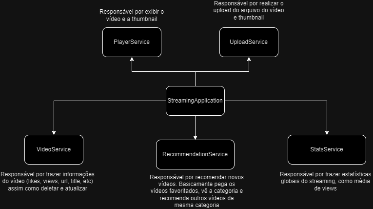
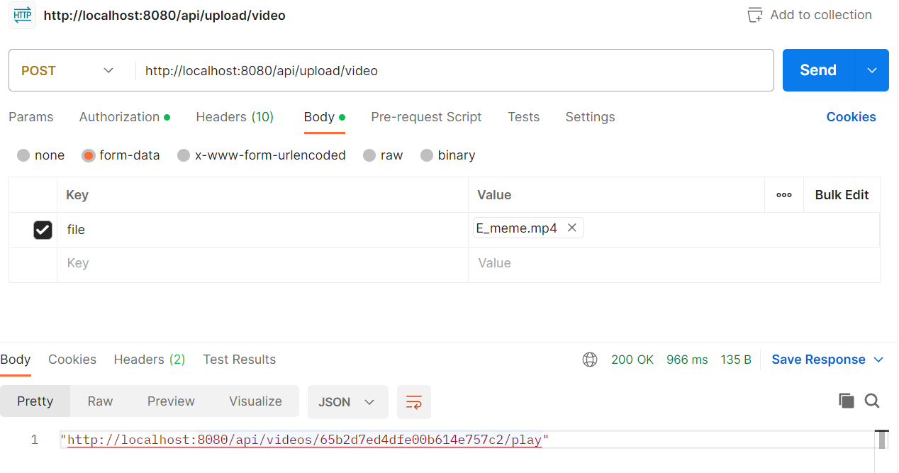
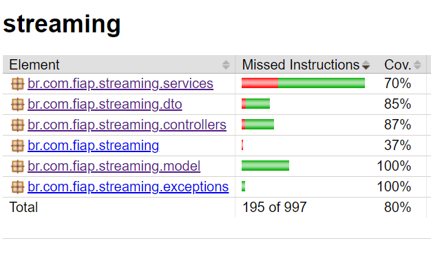

# Streaming Video Application



Esse projeto faz parte da pós graduação da FIAP, o objetivo dela é fazer uma API escrita em Spring Webflux para gerenciar vídeos como em uma plataforma de streaming.  Outras tecnologias utilizadas foram:

- MongoDB
- Spring Boot
- Lombok
- Jacoco (para os testes)

A arquitetura basicamente se baseia em separar as responsabilidades, de forma que simplificou a minha forma de desenvolvimento. Decidi por utilizar o mongoDB por oferecer gratuitamente o Atlas. Também decidi adotar a última versão do spring boot e do java para maiores aprendizados :)

## Guia de utilização

- Executando o projeto

``` bash
.\gradlew bootRun
```

Você poderá acessar a API no endpoint `http://localhost:8080`.

**Executando um vídeo:** `http://localhost:8080/api/videos/65b2d7ed4dfe00b614e757c3/play`

**Vendo informações de um vídeo:**
`http://localhost:8080/api/videos/65b2d7ed4dfe00b614e757c3`

**Vendo todos os vídeos:**
`http://localhost:8080/api/videos` (possível paginar e buscar por título, categoria e data de publicação, ex: `http://localhost:8080/api/videos?category=comedy`)

**Upload de vídeo**



- Obtendo uma visão geral dos testes

``` bash
.\gradlew jacocoTestReport
```

Na pasta `build` deverá ter um diretório chamado `jacocoHtml`, basta abrir no seu navegador de prefrência o arquivo `index.html` dentro dele.

